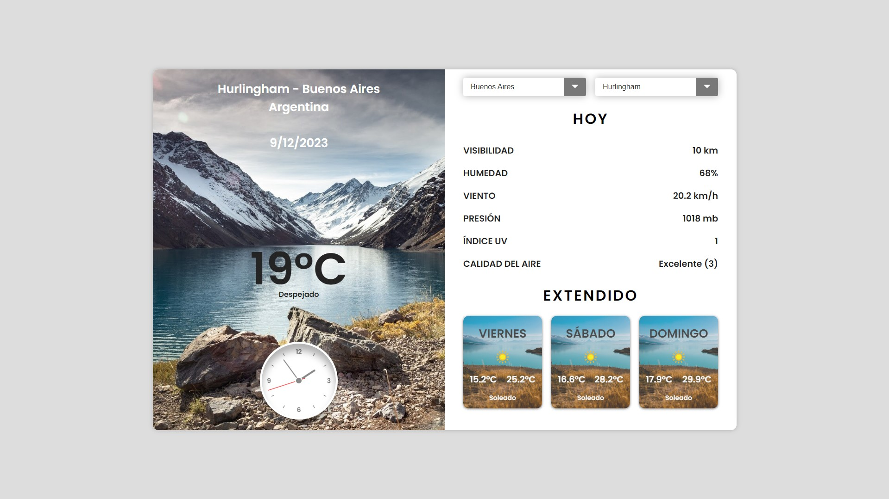
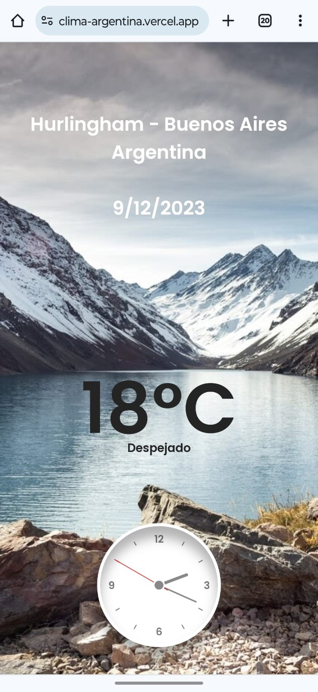
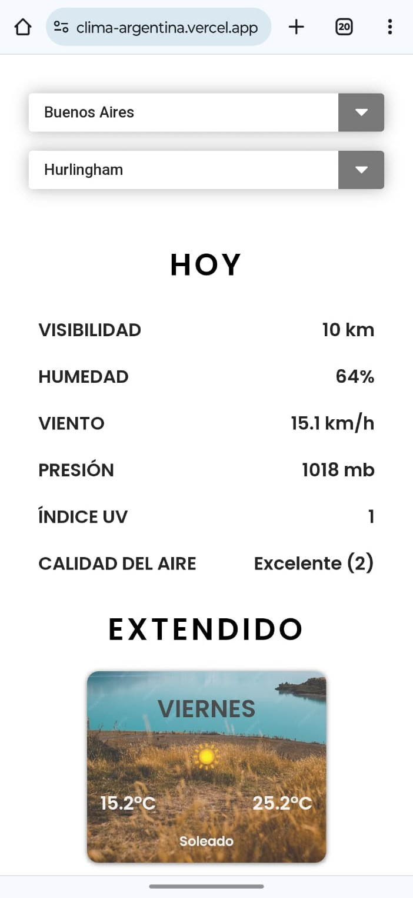
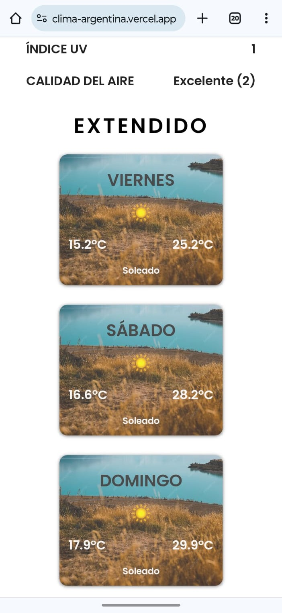

# Aplicación del clima

## Descripción

Bienvenido a la aplicación del clima de Argentina. Aquí podrás explorar las condiciones climáticas de cualquier ciudad del país. Además de proporcionar datos del clima actual, como visibilidad, humedad, presión, etc., también podrás consultar el pronóstico extendido de 3 días.



<div style="display: flex; justify-content: space-between;">
  
  
  
</div>

## Demo

Podes acceder a la demo de la aplicación en el siguiente link: [Clima](https://clima-argentina.vercel.app/)

## Tecnologías utilizadas

- React
- JavaScript
- HTML
- CSS

## APIs utilizadas

- API: [Weather API](https://www.weatherapi.com/)
  Utilice esta API para obtener la información del clima actual y el pronostico extendido de 3 días.
  PD: Para poder utilizar esta API, es necesario registrarse y obtener una API Key.
- API: [API del Servicio de Normalización de Datos Geográficos de Argentina](https://datosgobar.github.io/georef-ar-api/)
  Utilice esta API para obtener la información de las provincias y departamentos de Argentina.

## Instalación

Para poder instalar la aplicación en tu computadora, tenes que seguir los siguientes pasos:

1. Clonar el repositorio

   ```
   git clone https://github.com/Gonzalo09/clima.git
   ```

2. Acceder al directorio del proyecto

   ```
   cd clima
   ```

3. Instalar las dependencias

   ```
    npm install
   ```

4. Iniciar la aplicación

   ```
   npm run dev
   ```

5. Abrir el navegador e ingresar a la siguiente dirección: [http://127.0.0.1:5173/](http://127.0.0.1:5173/)

---

¡Gracias por visitar mi proyecto!
